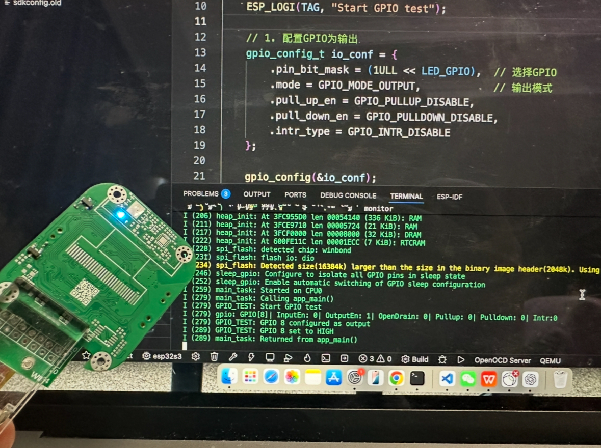
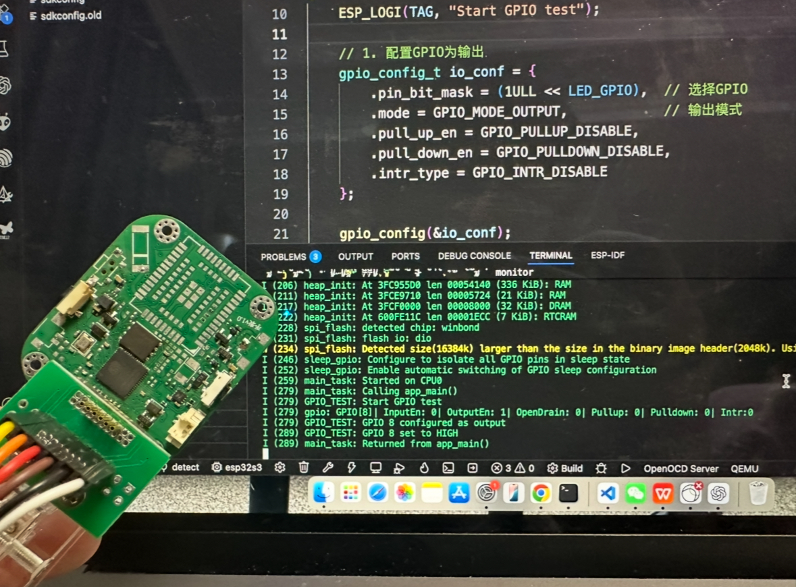
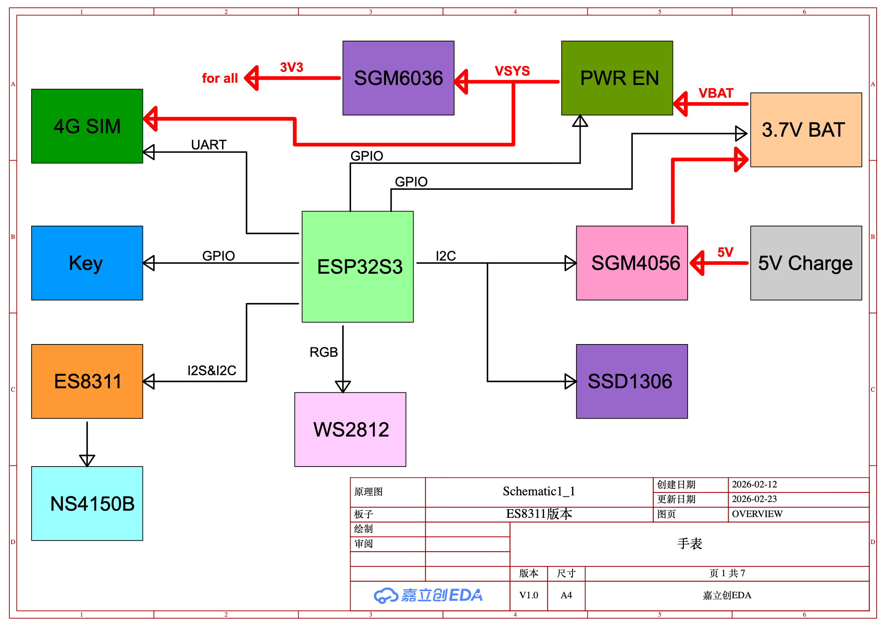
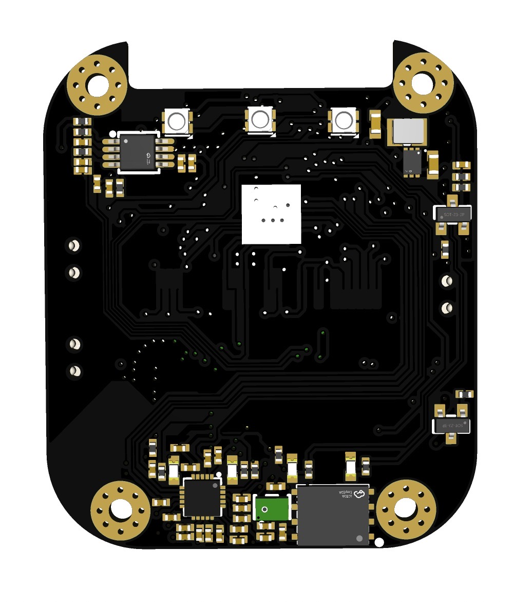

# esp32s3-4G-watch

    
    

该手表使用**ESP32S3**作为主控芯片

### 系统架构

    

外设包括:  
- 4G模组: ML307A-GCLN
- 音频解码: ES8311
- 音频功放: NS4150B
- 0.96寸屏幕: SSD1306
- WS2812彩灯
- 按键和LED

### 电源架构

该手表共有**两种电源输入**:
- 磁吸 5V
- 锂电池

由于4G模组对电流需求非常高(2A) 并未使用PMIC  
而是使用SGM4056线性充电IC实现充电功能  
锂电池的输出直接给整个电路供电
另外对于ESP32S3 和WS2812的输入做了个切换  
确保在关机状态下 使用磁吸5V充电 可以启动ESP32S3与彩灯  
方便在关机状态下观察充电情况  

  
  

